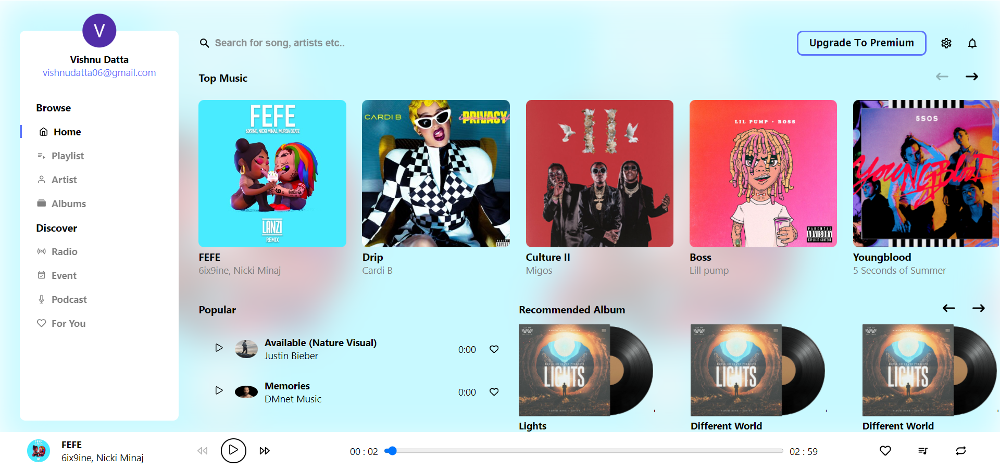

Description
Your Music Player App is a web-based application built with React, utilizing Firebase Realtime Database and Firebase Cloud Storage to provide a seamless and real-time music playback experience. This app allows users to listen to their favorite songs with a visually appealing interface, complete with cover art.

Features
Real-time music updates through Firebase Realtime Database.
Song storage and retrieval using Firebase Cloud Storage.
Intuitive and user-friendly music player controls.
Dynamic display of cover art for a visually rich experience.

Screenshot

### `npm start`

Runs the app in the development mode.\
Open [http://localhost:3000](http://localhost:3000) to view it in your browser.

The page will reload when you make changes.\
You may also see any lint errors in the console.

### `npm test`

Launches the test runner in the interactive watch mode.\
See the section about [running tests](https://facebook.github.io/create-react-app/docs/running-tests) for more information.
